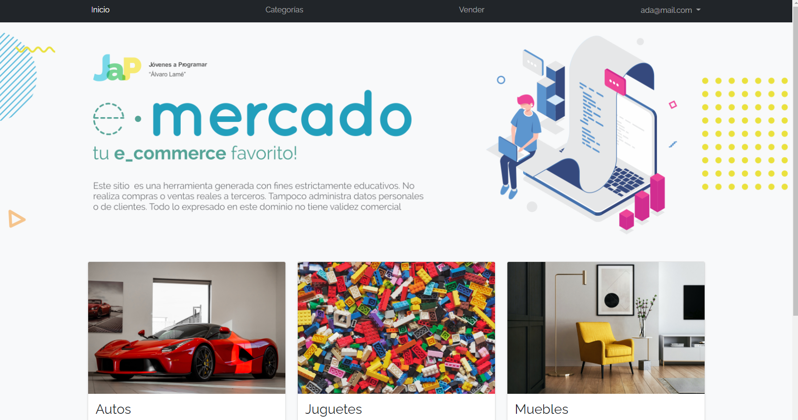
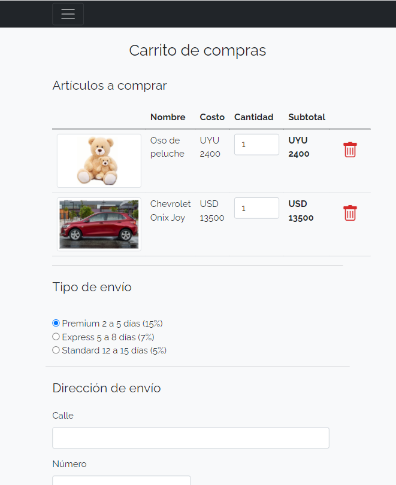
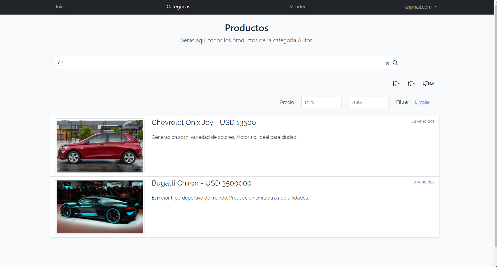
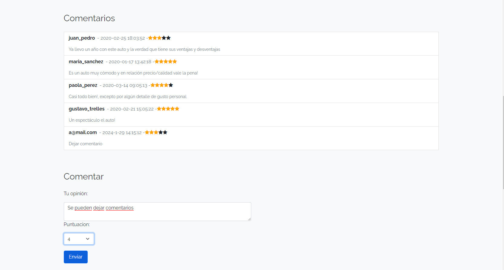
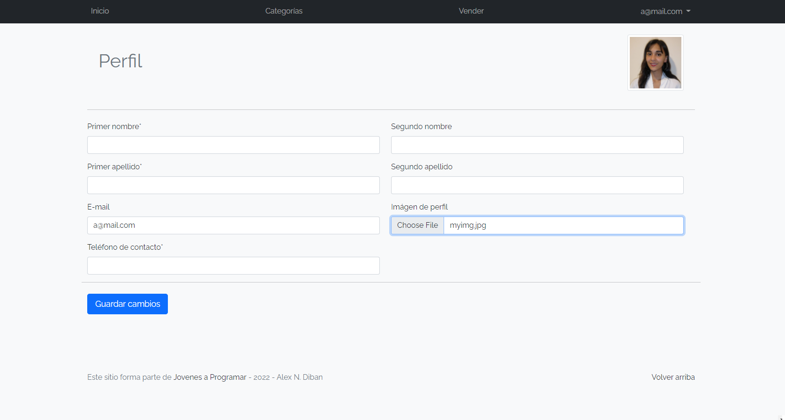

# E-commerce Website

<a href="https://jovenesaprogramar.edu.uy/">Jóvenes a programar</a> 2022 Final Project.

## Features
- **Developed with Javascript ⚙️, NodeJS 🚀, Express 🛣️**
- **User Login** 🔒🔑
- **External API Integration** 🌐🔗
- **Cart implementation with DB** 🛒🛍️
- **Users can search for products** 🔍🛍️
- **Users can leave comments** 💬✍️
- **Users can update their profile** 🔄👤

## Screenshots

### **Home Page**

### **Cart**

### **Search**

### **Comments**

### **Update profile**

